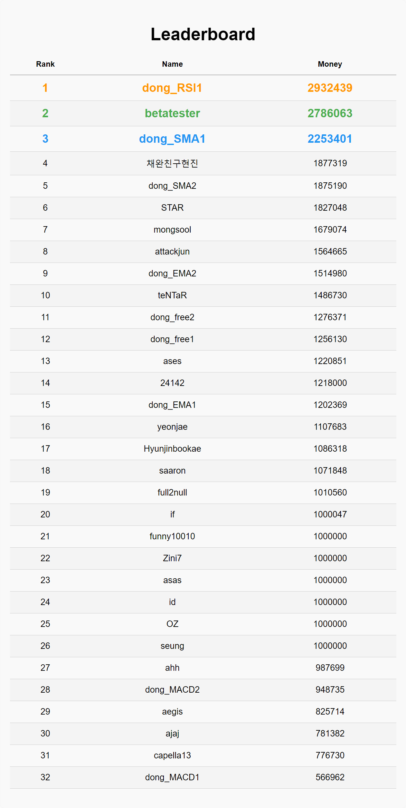

## 스파클 모의주식투자 활동

## 개요
하나고등학교 코딩 자율동아리 스파클에서 2024.05.26에 진행한 활동으로,
조별로 각각 조사하고 연구한 이론을 바탕으로, 
파이썬을 활용해 주식 자동매매 프로그램을 조별로 구현하였다.

## 인원
### 13기
- 안호성

### 14기
- 김민서B
- 김종원
- 박제인
- 안세용

### 15기
- 김민준
- 김연재B
- 박채완
- 손현진
- 이동현B
- 이승재
- 이준서A
- 이호준
- 조우제
- 최원우

## 내용
자체 개발한 모의주식투자 라이브러리 sparklestock을 활용하였다.
장단기 이동평균선, 딥러닝, 삼각수렴패턴 등 다양한 이론을 적용하였다.
조별로 구현한 다양한 알고리즘을 활용하여, 
자체개발한 모의주식투자를 위한 서버를 통해 주식 매매 경쟁을 진행하였다.
경쟁 이후엔 조별로 적용한 알고리즘에 대한 발표 또한 진행하였다.

## 결과
